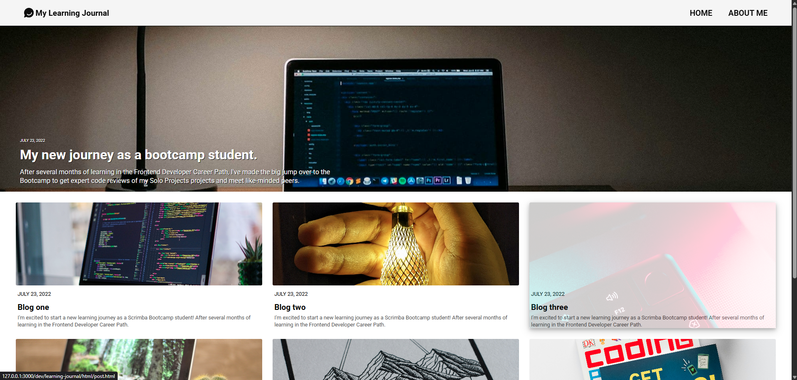
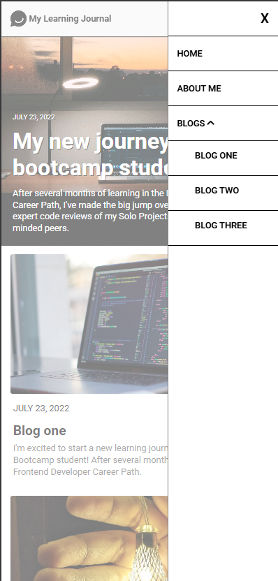

# Learning Journal
A simple blog site created, mainly focusing on the application of responsive web design at breakpoints of 480px and 768px.

## Getting Started
[Visit the website here.](https://learning-journal-wengti.netlify.app/)

## Features / Implementation
* Responsive Web Design
    - The mobile first design principle is adopted in this implementation.
    - The navigation bar
        - At window width >= 786px, it is fully displayed.
        - At window width < 768px, it is displayed as a bar icon tha expand into a overlay list when clicked.
    - The blog post grids
        - At window width >= 768px, it show 6 blog items (with the extra hidden and accessible by clicking on the "View More" button.)
        - At window width >= 480 px but < 768px, only 3 blog items are shown.
        - At window width < 480px, the blog items appear in a single column.
    - About Me
        - At window width >= 480px, the profile picture and self-introduction are side-by-side (in a flex-container).
        - At window width < 480px, they are in block display.

* Hovering effect
    - The hero post on the home page zoom in when it is hovered or focused.
    - The individual blog post card also stretch to cover the entire card and fade out when it is hovered or focused.
    - These 2 effects are achieved by making use of ::before pseudoclass that stacks a identical image on the original image used as a placeholder to maintain the layout.
        - When hovered, only the content in ::before are transformed.

## More Images
<table>
    <tr>
        <td></td>
    </tr>
    <tr>
        <td></td>
        <td></td>
    </tr>
</table>